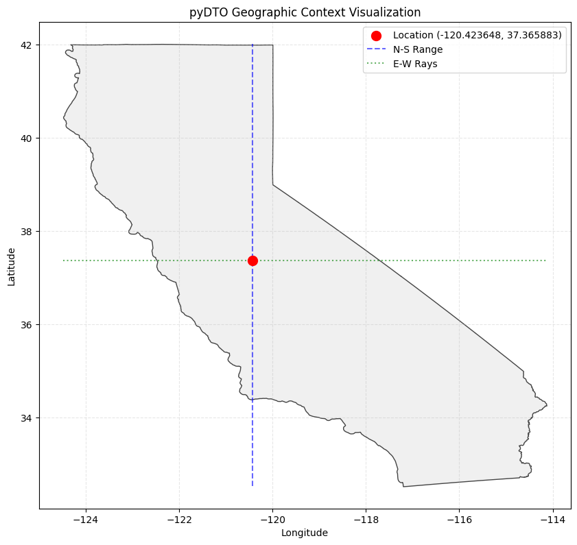

# A geospatial toolkit for calculating distances to California's geographic boundaries (pyDTO)
Fast, Python-based calculation of distances to the California coastline, terrestrial borders, and latitudinal extremes.

## Algorithm overview
The core engine of `pyDTO` employs a robust directional probing approach to determine geographic proximity. For East and West measurements, the algorithm utilizes ray-casting to identify the intersection points with the California state boundary; specifically, it captures the westernmost coastline to ensure reach to the open Pacific, and the nearest terrestrial boarder to the east along the point's latitude. For North and South orientations, the tool calculates the precise distance to the state’s latitudinal extremes (the Oregon and Mexico borders) along the meridian passing through the input coordinate. To ensure scientific accuracy, all spatial operations are performed within a planar coordinate system, providing reliable Euclidean distances in kilometers.

## How to use this repository
### Repository installation
```bash
pip install "git+https://github.com/RuiGao9/pyDTO.git"
```

### Required inputs
`Latitude` and `Longitude` of the location within California state are required. Error will raise if the location is outside of the California state.

### How to get the distance?
`run_demo.ipynb` is the demo notebook showing you how to call functions to get the distances.<br>
There are two main functions:
- `pyDTO.get_dist()` calculates the distance for each direction and returns the results in a dictionary. You can easily access the values as shown below:
```python
[to_n, to_s, to_e, to_w] = [res['distances'][d] for d in ['North', 'South', 'East', 'West']]
```

- `pyDTO.plot_dto()` provides a visual summary of the geographic context, including the state boundary, input location, and directional rays.

In summary, you can use code below to get the results, and one demo location from University of California, Merced, was used. The corresponding figure result is shown in Figure 1.

```python
import pyDTO
print(f"The data format of the California polygon is: {type(pyDTO.api._CA_POLYGON)}")

# One example
[merced_lon, merced_lat] = [-120.423648, 37.365883]
res = pyDTO.get_dist(merced_lon, merced_lat)
# Extract distances from the dictionary and print them in a formatted way
[to_n, to_s, to_e, to_w] = [res['distances'][d] for d in ['North', 'South', 'East', 'West']]
print(  f"To the northest point of the boundary (parallel to the prime meridian): {to_n:.2f} km;\n" 
        f"To the southest point of the boundary (parallel to the prime meridian): {to_s:.2f} km;\n"
        f"To the east boundary (parallel to equator): {to_e:.2f} km;\n"
        f"To the west boundary (parallel to equator): {to_w:.2f} km")
pyDTO.plot_dto(merced_lon, merced_lat)
```

<figure>
  
  <figcaption>Figure 1: Geometric logic for directional boundary analysis. Distances are calculated as follows: West reflects the farthest intersection with the coastline; East represents the nearest contact with the state border; North and South measure the distance to the state’s latitudinal extremes along the meridian. </figcaption>
</figure>

## How to cite this work

## Repository update information
- Creation date: 2026-04-13
- Last update: 2026-04-13
- Contact: If you encounter any issues or have questions, please contact Rui Gao at Rui.Ray.Gao@gmail.com